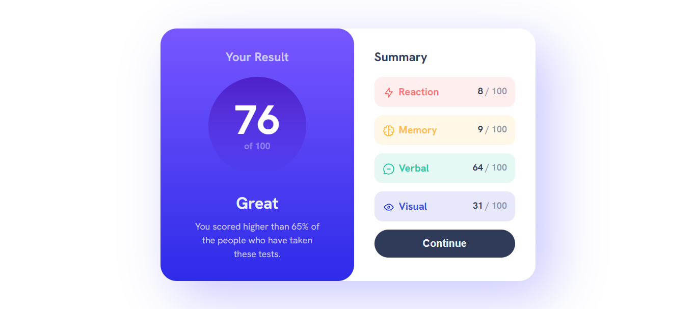

# Frontend Mentor - Results summary component solution

This is a solution to the [Results summary component challenge on Frontend Mentor](https://www.frontendmentor.io/challenges/results-summary-component-CE_K6s0maV). Frontend Mentor challenges help you improve your coding skills by building realistic projects. 

## Table of contents

- [Overview](#overview)
  - [The challenge](#the-challenge)
  - [Screenshot](#screenshot)
  - [Links](#links)
- [My process](#my-process)
  - [Built with](#built-with)
  - [What I learned](#what-i-learned)
  - [Continued development](#continued-development)
- [Author](#author)

## Overview

### The challenge

Users should be able to:

- View the optimal layout for the interface depending on their device's screen size
- See hover and focus states for all interactive elements on the page
- **Bonus**: Use the local JSON data to dynamically populate the content

### Screenshot

### Links

- Solution URL: [Add solution URL here](https://your-solution-url.com)
- Live Site URL: [result-summary-component](https://poplarbeargi.github.io/result-summary-component/)

### Built with

- Semantic HTML5 markup
- CSS custom properties
- Flexbox
- 
### What I learned
uses of pseudo classes, pseudo elements, and data* attribute. 

### Continued development
I'm going to make it work with the JSON data next time.

## Author

- Website - [poplarbeargi](https://poplarbeargi.github.io/result-summary-component/)
- Frontend Mentor - [@poplarbeargi](https://www.frontendmentor.io/profile/poplarbeargi)
